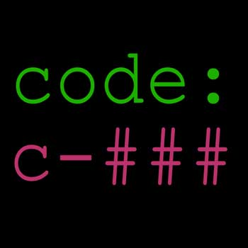

<div align="center">
  
</div>

# Description
### This package helps you to create safe numeric codes with your custome template.  
### The template you enter is a required value for the generator function and must contain a number of `#` to replace each `#` with a digit.

### _Note that this program can only create codes up to `8` digits!_

### The numbers generated by this package pass the following conditions:

- The number of repetitions of each digit in the whole number cannot be more than two times.

  For example, the number `23242` is not allowed because the digit `2` appears three times.

- Only one digit can appear twice in the whole number and the rest of the digits are not allowed to be repeated.

  For example, the number `2332` is not allowed.

- Only two consecutive digits are allowed together.

  For example, numbers `232` or `234` are not allowed, but `235` is allowed

- Consecutive numbers can only appear once in the whole number.

  For example, in the number `2354`, because `2` and `3` are next to each other and `4` and `5` are next to each other, it is not allowed!

# How to use
### install package
```
composer require https://packagist.org/packages/am-mokhtari/numeric_code
```

use the ***generator()*** static function and set a template like below:
```
$string_code = NumericCode::generate('new code : #-#/#&#');
```
the output will be like this:
> "new code : 3-5/6&3"

.

----
----

.


# توضیحات
### این پکیج به شما کمک میکند تا کد های عددی ایمن با قالب دلخواه بسازید.  
### قالبی که وارد میکنید یک مقدار الزامی برای تابع سازنده است و باید شامل تعدادی `#` باشد تا به جای هر `#` یک رقم قرار گیرد.

### *توجه کنید که این برنامه فقط تا `۸` رقم کد ایجاد می کند!*

### اعدادی که توسط این پکیج ساخته میشوند شرط های زیر را پاس میکنند:
<ul dir="rtl">
<li>

  تعداد تکرار هر رقم در کل عدد نمیتواند بیش از دو مرتبه باشد.
  
  مثلا عدد `۲۳۲۴۲` چون سه مرتبه عدد `۲` ظاهر شده مجاز نیست.
</li>
<li>

  فقط یک رقم میتواند در کل عدد دو مرتبه ظاهر شود و باقی ارقام مجاز به تکرار نیستند.
  
  مثلا عدد `۲۳۳۲` مجاز نیست.
</li>
<li>

  فقط دو رقم متوالی در کنار هم مجاز هستند.
  
  مثلا عدد `۲۳۲` یا `۲۳۴` مجاز نیستند ولی `۲۳۵` مجاز است
</li>
<li>

  اعداد متوالی در کنار هم فقط یکبار میتوانند در کل عدد ظاهر شوند.
  
  مثلا، در عدد `۲۳۵۴` چون `۲` و `۳` کنار هم و `۴` و `۵` کنار یکدیگر هستند و مجاز نیست!
</li>
</ul>

# نحوه ی استفاده
### پکیج را با دستور زیر نصب کنید
```
composer require https://packagist.org/packages/am-mokhtari/numeric_code
```

از تابع استاتیک **generator()** استفاده کنید و قالب مورد نظر را به آن بدهید، مثل کد زیر:
```
$string_code = NumericCode::generate('new code : #-#/#&#');
```
خروجی چیزی شبیه به این خواهد بود:
> "new code : 3-5/6&3"

.

.
